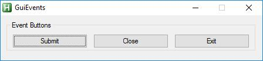

# Event Buttons  

* Submit button  
* Close button  
* Exit button  

### Button methods  

| __submit__( [$text] )	|Makes submit button	|  
|:---	|:---	|  
|`@param string` [ $text="Submit" ]	|button text	|  
|`@return self`	|	|  

##  

| __close__( [$text] )	|Makes close button	|  
|:---	|:---	|  
|`@param string` [ $text="Close" ]	|button text	|  
|`@return self`	|	|  

##  

| __exit__( [$text] )	|Makes exit button	|  
|:---	|:---	|  
|`@param string` [ $text="Exit" ]	|button text	|  
|`@return self`	|	|  

##  

[include:\controls-event.ahk]  

__Produce this buttons__  
  

  