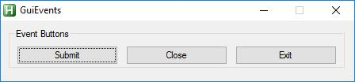

# Event Buttons  
* Submit button  
* Close button  
* Exit button  

## Button methods  
| __submit__( [$text] )    |Makes submit button    |  
|:---    |:---    |  
|`@param string` [ $text="Submit" ]    |Text of button    |  
|`@return self`    |    |  
##  
| __close__( [$text] )    |Makes close button    |  
|:---    |:---    |  
|`@param string` [ $text="Close" ]    |Text of button    |  
|`@return self`    |    |  
##  
| __exit__( [$text] )    |Makes exit button    |  
|:---    |:---    |  
|`@param string` [ $text="Exit" ]    |Text of button    |  
|`@return self`    |    |  

## Examples  

``` php
$Gui.Controls
    .Button().submit()
    .Button().close()
    .Button().exit()            

```  
## Result  
  
  