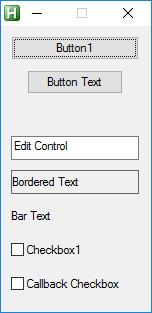
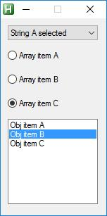

# Class Controls  
## Create controls  

## Common Methods  
Methods shared with all control types  

__add__( [string __$id__] ) // @return object __Control__  
	// add control to gui with given id, $id is used as value if value is not defined  

__callback__( $string __$fnName__, __$params__* ) // @return object __Control__  
	// callback fn for control, any number of parameters  

__options__( string __$options__ ) // @return object __Control__  
	// @param __$options__ strings of [options](https://autohotkey.com/docs/commands/Gui.htm#Controls_Uncommon_Styles_and_Options)  
	// E.G: "w256 h64 x+16 y+32 border"  

------------------------------------------------------------------------------------------------------------------------------------  

## Basic controls  

* Button  
* Edit  
* Text  
* Checkbox  

#### Methods  

__value__( string __$value__ ) // @return object __Control__  
// value of control  

[include:\controls-basic.ahk]  
  

------------------------------------------------------------------------------------------------------------------------------------  

## Items controls  

* Dropdown  
* Radio  
* ListBox  

### Methods  

__items__( string|array|object __$items__ ) // @return object __Control__  
    // items in control  
    // selected item in array & object is marked with pipe "|" on end of item E.G: __"A|B||C"__  
    // selected item in string is maked with doublepipe "||"  E.G: __["A", "B|", "C"]__  

__checked__( int|string __$key__ ) // @return object __Control__  
    // key or index of seleted item  
    // overides items selection, in listbox add to selection  

__clear__() // @return object __Control__  
	// remove items  

## Examples  

[include:\controls-items.ahk]  
  

  