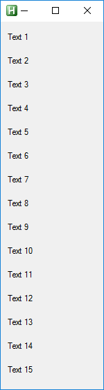

# Gui scrollbar  

* VilGui covers Autohotkey`s difficulties with scrollbar  
* Vertical bar __appears or disappear when gui window is resized__  
* Horizontal scrollbar is not tested yet  

## Examples  
``` php
Loop, 15
	$Gui.Controls.Text("Text " A_Index).add()

$Gui.resizeable()
	.create()

$toggle := true

/* Toggle size
*/
Loop
{
	if( $toggle==true )
		$Gui.size("",128)
	else
		$Gui.autosize()

	$toggle := $toggle!=true
	sleep, 2000
}



```  

## Result  
  