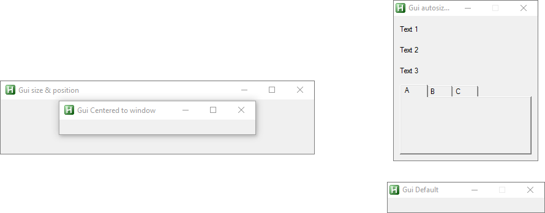

# Gui setup  

## Examples  
``` php
/* Example 1
*/
new VilGUI("Gui Default").create()

/* Example 2
*/
new VilGUI("Gui size & position")
    .resizeable()
    .position(512,512)   ; init position
    .size(512, 128)      ; init size
    .minSize(128, 128)   ; min height & width 
    .maxSize("", 1024)   ; max height
    .create()

/* Example 3
*/
new VilGUI("Gui Centered to window")
    .alwaysOnTop()
    .resizeable()
    .fixedWidth(320)         ; without parameter fixed to current size
    .options("+MaximizeBox") ; custom options
    .center("window")        ; center to last active window 
    .create()
```  

## Result  
  