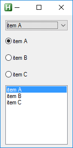

# Controls colors  
Set color for focused control  
* globally  
* per control type  

| __focus__( [$background], [$foreground], [$control_type] )    |Set color of focused control    |  
|:---    |:---    |  
|`@param string\|hex` [ $background="" ]    |color    |  
|`@param string\|hex` [ $foreground="" ]    |color    |  
|`@param string` [ $control_type="" ]    |type of control to apply focus colors    |  

## Examples  

``` php
/* DEFINE COLORS
*/
$Gui.Style.Color
    .focus( 0x00FF00, 0xFF0080)
    .focus( "024FC0", "FFFFFF", "listbox")

/* ADD CONTROLS
*/
$items := ["item A|", "item B", "item C"]

$Gui.Controls
    .Dropdown().items($items).add()    
    .Radio().items($items).add()
    .ListBox().items($items).add()
    
        
```  
## Result  
  